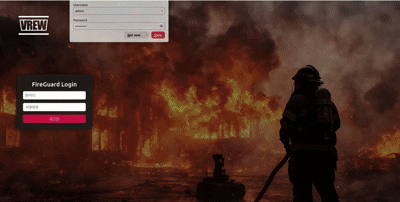
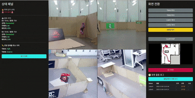

# 🚒 Fire Guard AMR (Autonomous Mobile Robot System)

 

## 🗂️ Table of Contents

### 1. [Project Overview](#-project-overview)
### 2. [Operation Scenario](#-operation-scenario)
### 3. [Team & Roles](#-team--roles)
### 4. [Tech Stack](#-tech-stack)
### 5. [System Architecture](#-system-architecture)
### 6. [Demo Video](#-demo-video)
### 7. [Key Achievements](#-key-achievements--learnings)

 

---

## 🔍 Project Overview
**"Real-time Fire Detection & Golden Time Response System"**

**Fire Guard AMR**은 화재 발생 시 골든타임을 확보하여 안전성과 효율성을 극대화하는 자율주행 로봇 시스템입니다.
건물 내 CCTV(Webcam)가 화재를 실시간으로 감지하면, **화재 진압 로봇(Robot A)**이 해당 구역으로 즉시 출동하여 초기 진압을 시도하고, 동시에 **대피 안내 로봇(Robot B)**은 건물 내부를 순찰하며 사람을 인식해 안전한 대피소로 유도합니다.

#### 📆 Development Period : 2025.11.24 ~ 2025.12.05

 

## 🎞️ Operation Scenario

1.  **Detection:** WebCam 기반 모니터링 시스템이 화재 발생 감지
2.  **Alert:** 관제 시스템에서 화재 경보 발령 및 소방서 자동 신고
3.  **Dispatch:** 화재 진압 로봇(Robot A)과 대피 안내 로봇(Robot B) 동시 출동
4.  **Robot A (Fire Suppression):**
    * 관제 시스템으로부터 전달받은 발화 지점으로 자율주행 이동
    * 화재 재확인 후 초기 진압 절차 수행
5.  **Robot B (Evacuation Guide):**
    * 지정된 구역 순찰(Patrol) 시작
    * 사람 감지(Human Detection) 시 접근하여 경고 음성 송출
    * 가장 가까운 비상구/대피소로 에스코트
6.  **Return:** 상황 종료 시 임무 완수 보고 후 초기 위치(Docking Station)로 복귀

 

## 👥 Team & Roles

| Name | Role | Responsibility |
|:---:|:---:|:---|
| **Kim Hyo-won**   **Kim Gap-min** | Team Leader   Team Member | - **System Integration:** WebCam - DB - Monitoring System 통합 구축   - **Robot B Logic:** 사람 인식(Human Detection) 및 접근(Approach), 순찰(Patrol) 알고리즘 구현   - **Mapping:** Custom Map 생성 및 최적화 |
| **Kang Dong-hyuk**   **Kim Jung-wook** | Team Member | - **SLAM & Navigation:** 실제 환경 기반 SLAM 지도 생성, TF(좌표계) 구성 및 원점 교정   - **Feature Dev:** YOLO 기반 Alert Sound 노드 패키지 개발, 시연 영상 편집 |
| **Kim Da-bin**   **Lee Hyo-won** | Team Member | - **AI Vision:** YOLO Fine-tuning, WebCam 화재 감지 모델 최적화   - **System Design:** System Diagram 설계, Robot A 통합 로직 구현 |
| **Lee Yong-woo**   **Hwang Hye-in** | Team Member | - **Web/DB:** Flask 서버 구축 및 UI 디자인, DB 로그 기록 시스템 개발   - **Integration:** Web UI를 활용한 전체 시스템 모니터링 연동 |

 

## 💻 Tech Stack

| Category | Technology |
| :---: | :--- |
| **OS** |  |
| **Middleware** |  |
| **AI / Vision** |   |
| **Autonomous** |    |
| **Web / DB** |   |
| **Language** |  |
| **Tools / Libs** |    |

 

## 📝 System Architecture

### Core Logic: Zone Mapping System
* **Coordinate Conversion:** CCTV 화면상의 화재 위치를 로봇의 실제 주행 좌표(Map Frame)로 변환하는 **Zone Mapping 알고리즘**을 적용하여 정밀한 출동이 가능합니다.

 

## 🎥 Demo Video

 

## 🏆 Key Achievements & Learnings

### ✅ Project Achievements
* **Centralized Web Monitoring:** Flask와 SQLite3를 활용해 **4분할 CCTV 모니터링, 로봇 원격 제어, 출동 로그(Log) 관리**가 가능한 통합 관제 대시보드 구축.
* **End-to-End System Integration:** 화재 감지(Vision) → 좌표 변환(Logic) → 로봇 출동(Nav2) → 관제(Web)로 이어지는 전체 시스템 파이프라인 완성.
* **Multi-Robot Coordination:** 진압 로봇(A)과 안내 로봇(B)의 역할을 분담하고 유기적으로 협업하는 시나리오 구현.

### 💡 Technical Insights
* **Real-time Event Handling:** YOLO 기반의 객체 인식 결과가 ROS2 DDS 통신을 통해 지연 없이 처리되는 구조를 설계했습니다.
* **Full-Stack Robotics:** 로봇 하드웨어 제어뿐만 아니라 웹 서버 및 DB 연동을 통해 사용자 친화적인 인터페이스를 개발하는 경험을 쌓았습니다.
* **Nav2 Pipeline Mastery:** 다중 로봇(Multi-Robot) 환경에서의 Path Planning, SLAM, TF Tree 구조를 다루며 자율주행 시스템 아키텍처에 대한 깊이 있는 이해를 얻었습니다.
